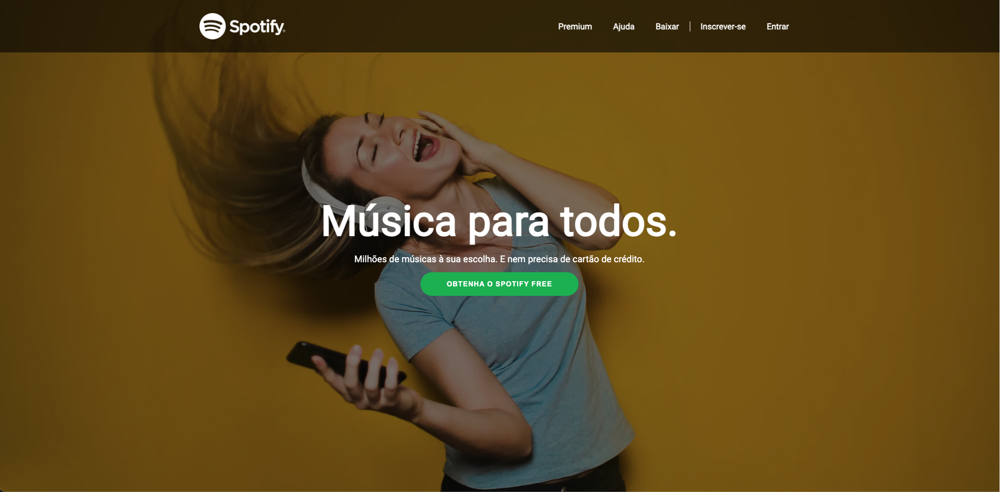

# Clone do Spotify - Projeto Front-End

## Descrição do Projeto

Este projeto é um clone front-end da página do Spotify. 
Desenvolvi esta aplicação como parte do Desafio Guiado da Ima tech, com o objetivo de aprimorar minhas habilidades em HTML e CSS.

## Tecnologias Utilizadas

- HTML
- CSS
